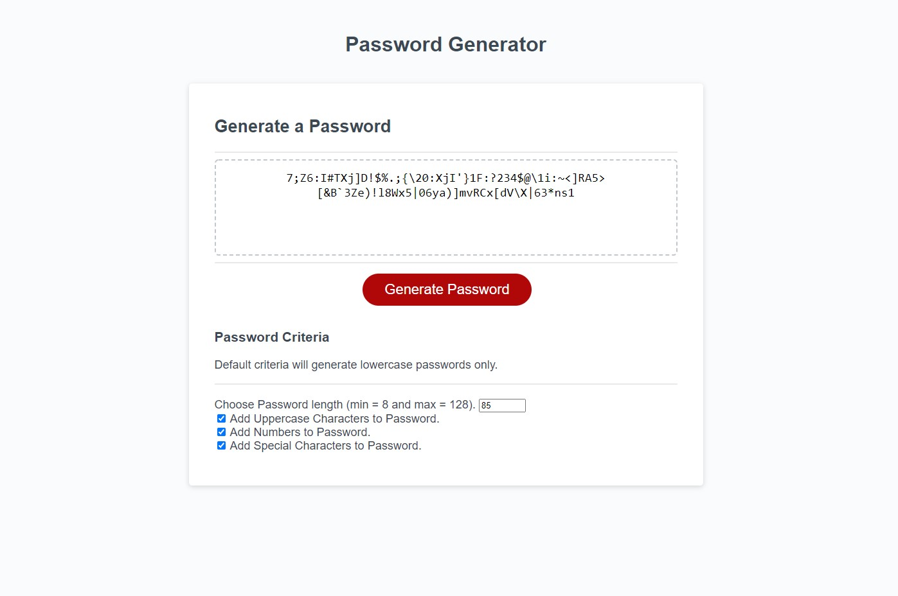

# Password-Generator

## User Story
A employee with access to sensitive data wants to randomly generate a password that meets certain criteria
so that they can create a strong password that provides greater security.

## Criteria fullfilled

```
Password is generated when clocking a button.
Generated password will include any criteria choosen. 

Criteria Includes :-
        Length of 8-128 charchters.
        option to include:-
                    lowercase, 
                    uppercase, 
                    numeric, 
                    and/or special characters.

At least one character type will be included from the the selected criteria when password is generated. 
Password Updates with all criteria selected every time it is selected. 

```

## Screenshot



## Github

https://github.com/Gedionadamu/Password-Generator